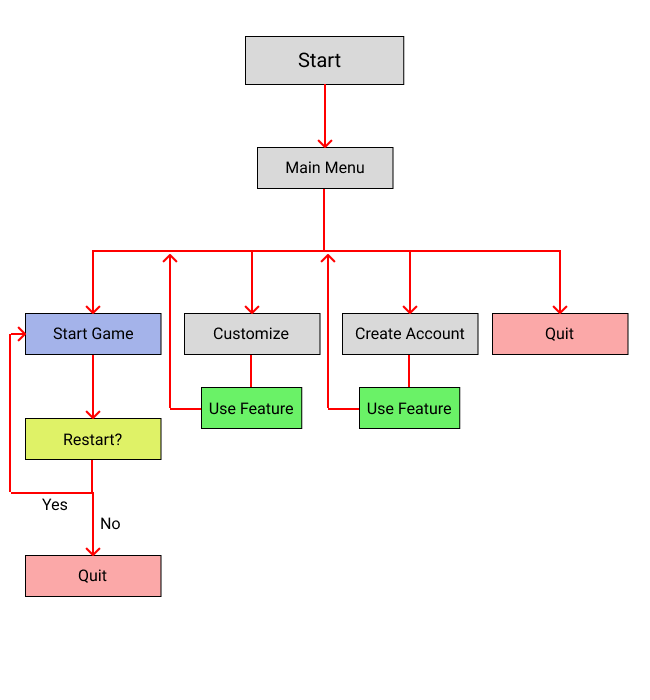

# T1A3 Terminal Application Assignment
Coder Academy Term 1 Assignment 3
### Student: Fabian Sugandhi

[Github Repository](https://github.com/FabSugandhi/FabianSugandhi_T1A3)

[Source Control Repository](https://github.com/FabSugandhi/FabianSugandhi_T1A3/commits/main)

[Implementation Plan](https://github.com/users/FabSugandhi/projects/2/views/1)

## Style Guide

This terminal application is made to follow coding conventions set out in [PEP 8](https://peps.python.org/pep-0008/) style guide for Python code (van Rossum, et. al., 2023) as close as possible. [Pylint](https://pypi.org/project/pylint/) and its [Visual Studio Code extension](https://marketplace.visualstudio.com/items?itemName=ms-python.pylint) has also been used to help maintain adherence to PEP 8 (LogiLab & Pylint Contributors, 2023).
While PEP 8 suggested that codes are limited to 79 characters per lime, some of the code lines in this application might be longer than this recommendation. This is a done on purpose, as they would either not make as much sense or not function as intended should they be separated into multiple lines to conform to the PEP 8 recommendation.

## Features & Functions

This Connect Four terminal application is designed to allow users to play the traditional "Connect Four™" game created by Hasbro Inc. (Hasbro, 2024) with added features and functionality to suit the virtual environment.

Here is the flowchart showing how the terminal menu and functions interact:

### Main Menu

This acts as a source of landing area once the terminal application is started. The users will have to options to either:
- Start a new game
- Customize settings
- Create a new account
- Quit the application

When the option to start a new game is selected, each player will be prompted to enter their username. If both players' usernames have already been registered before, the game will then start. The flow of the game will be explained in the below section. However, if any of the players' usernames is not registered, the application will identify this issue and will bring the player to the account creation menu, prompting them to create a new account.

When the option to customize settings is selected, the application will ask for the username of the account that the user wants to modity. If the username is already registered, the application will ask the user to input their new preferred player customization settings (that is the piece type and the piece color). If the username is not registered however, the application will identify this and prompt the user to create a new account with this username.

When the option to create new account is selected, the player will be asked for a username for this account, then the preferred piece type (what character will be displayed as their game piece), and then the color of their piece. [Colorama](https://pypi.org/project/colorama/) has been used to add and display this color functionality, and thus the user will be prompted to only pick Colorama supported colors (Hartley, et. al., 2020). The application also checks if the same username is already registered when this create account option is selected and will prevent the user from creating a new account with the same username.

### Connect Four Match

The main feature of this terminal application. It generates a "Connect Four™" (Hasbro, 2024) board and its corresponding game pieces which will then be used in a 2-player match of the game. 

The match follows the established rule of the traditional "Connect Four™" (Hasbro, 2024) game, which involves:
- Standard-sized game board, consisting of 7 columns and 6 rows.
- Winning condition of stacking 4 game pieces consecutively (either horizontally, vertically, or diagonally).
- Game draw condition of filling out the whole board without having any player reaching the winning condition.
- The game flow which consists of players taking turns dropping their pieces on the board. This is done by inputting the intended column number. This game flow will continue until either one player achieves the winning condition or the game draw condition is met.

Once a game is completed, the winning board will be shown and the match result will be shown and recorded into the user accounts. The players are then given the option to restart the game with a fresh board or go back to the main menu.

### User Account System

This feature allows the user to create their own personal account, with customized username, piece color, and piece shape. This feature also records the match results of each user account, which will be displayed after each game. The user data is storen in a separate JSON file title "settings.json" as a dictionary each with their own unique information, saved in the same directory as the other python files for easy access.

All functions that relates to the saving and loading of these user information into and from the JSON file are all constrained in one python file, that is **settings.py**.