# T1A3 Terminal Application Assignment

Coder Academy Term 1 Assignment 3

## Student: Fabian Sugandhi

[Github Repository](https://github.com/FabSugandhi/FabianSugandhi_T1A3)

[Source Control Repository](https://github.com/FabSugandhi/FabianSugandhi_T1A3/commits/main)

[Implementation Plan](https://github.com/users/FabSugandhi/projects/2/views/1)

## Style Guide

This terminal application is made to follow coding conventions set out in [PEP 8](https://peps.python.org/pep-0008/) style guide for Python code (van Rossum, et. al., 2023) as close as possible. [Pylint](https://pypi.org/project/pylint/) and its [Visual Studio Code extension](https://marketplace.visualstudio.com/items?itemName=ms-python.pylint) has also been used to help maintain adherence to PEP 8 (LogiLab & Pylint Contributors, 2023).
While PEP 8 suggested that codes are limited to 79 characters per lime, some of the code lines in this application might be longer than this recommendation. This is a done on purpose, as they would either not make as much sense or not function as intended should they be separated into multiple lines to conform to the PEP 8 recommendation.

## Features & Functions

This Connect Four terminal application is designed to allow users to play the traditional "Connect Four™" game created by Hasbro Inc. (Hasbro, 2024) with added features and functionality to suit the virtual environment.

Here is the flowchart showing how the terminal menu and functions interact:


### Main Menu

This acts as a source of landing area once the terminal application is started. The users will have to options to either:

- Start a new game
- Customize settings
- Create a new account
- Quit the application

When the option to start a new game is selected, each player will be prompted to enter their username. If both players' usernames have already been registered before, the game will then start. The flow of the game will be explained in the below section. However, if any of the players' usernames is not registered, the application will identify this issue and will bring the player to the account creation menu, prompting them to create a new account.

When the option to customize settings is selected, the application will ask for the username of the account that the user wants to modity. If the username is already registered, the application will ask the user to input their new preferred player customization settings (that is the piece type and the piece color). If the username is not registered however, the application will identify this and prompt the user to create a new account with this username.

When the option to create new account is selected, the player will be asked for a username for this account, then the preferred piece type (what character will be displayed as their game piece), and then the color of their piece. [Colorama](https://pypi.org/project/colorama/) has been used to add and display this color functionality, and thus the user will be prompted to only pick Colorama supported colors (Hartley, et. al., 2020). The application also checks if the same username is already registered when this create account option is selected and will prevent the user from creating a new account with the same username.

### Connect Four Match

The main feature of this terminal application. It generates a "Connect Four™" (Hasbro, 2024) board and its corresponding game pieces which will then be used in a 2-player match of the game.

The match follows the established rule of the traditional "Connect Four™" (Hasbro, 2024) game, which involves:

- Standard-sized game board, consisting of 7 columns and 6 rows.
- Winning condition of stacking 4 game pieces consecutively (either horizontally, vertically, or diagonally).
- Game draw condition of filling out the whole board without having any player reaching the winning condition.
- The game flow which consists of players taking turns dropping their pieces on the board. This is done by inputting the intended column number. This game flow will continue until either one player achieves the winning condition or the game draw condition is met.

Once a game is completed, the winning board will be shown and the match result will be shown and recorded into the user accounts. The players are then given the option to restart the game with a fresh board or go back to the main menu.

### User Account System

This feature allows the user to create their own personal account, with customized username, piece color, and piece shape. This feature also records the match results of each user account, which will be displayed after each game. The user data is storen in a separate JSON file title "settings.json" as a dictionary each with their own unique information, saved in the same directory as the other python files for easy access.

All functions that relates to the saving and loading of these user information into and from the JSON file are all constrained in one python file, that is **settings.py**.

## Implementation Plan

In order to keep track and manage the deadline of this assignment, I have used [GitHub Projects](https://docs.github.com/en/issues/planning-and-tracking-with-projects/learning-about-projects/about-projects) as my project management platform (GitHub, 2023). The process of this project setup was as follows:

- Create issue items for each feature of the application (game logic, main menu, settings).
- Create issue items for other steps of the application development (testing, debugging, cleaning up, etc.).
- Create lists of taks that will be involved in developing each of the issue items.
- Rearrange and edit some of the task items as the project develops and ideas get added or removed.

Each of the issue items were also assigned to specific dates in order to maintain consistency of the project workflow as each items are connected with each other. Although, in the end the schedule was not followed as closely as I overestimated the time required to complete certain tasks (such as the menu integration) and underestimated for other tasks (such as the player settings and game logic).

Here are the screenshots of my project management platform and the issue items.

### Current State of Implementation Plan (End of Project Screenshots)

#### Overview of Implementation Plan

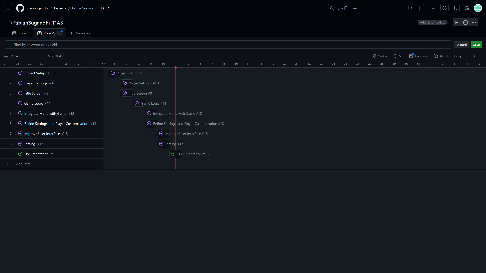

#### Project Setup

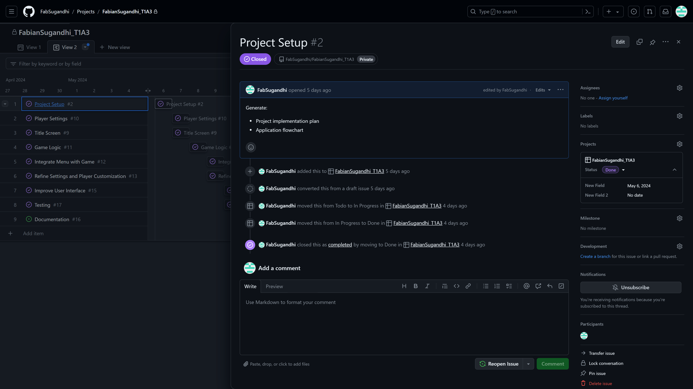

#### Player Settings

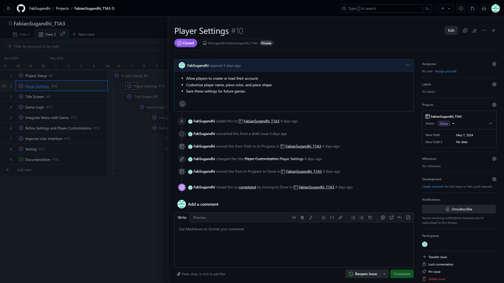

#### Title Screen

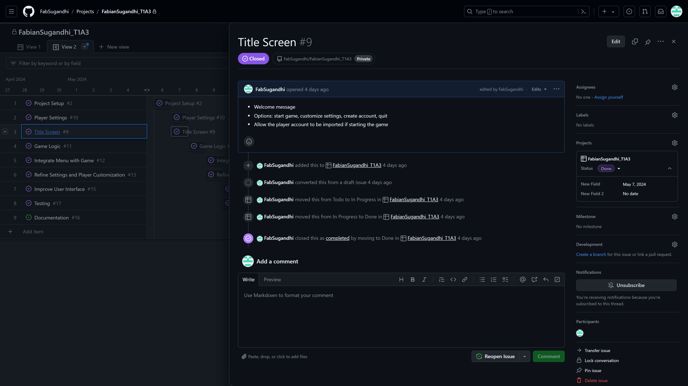

#### Game Logic

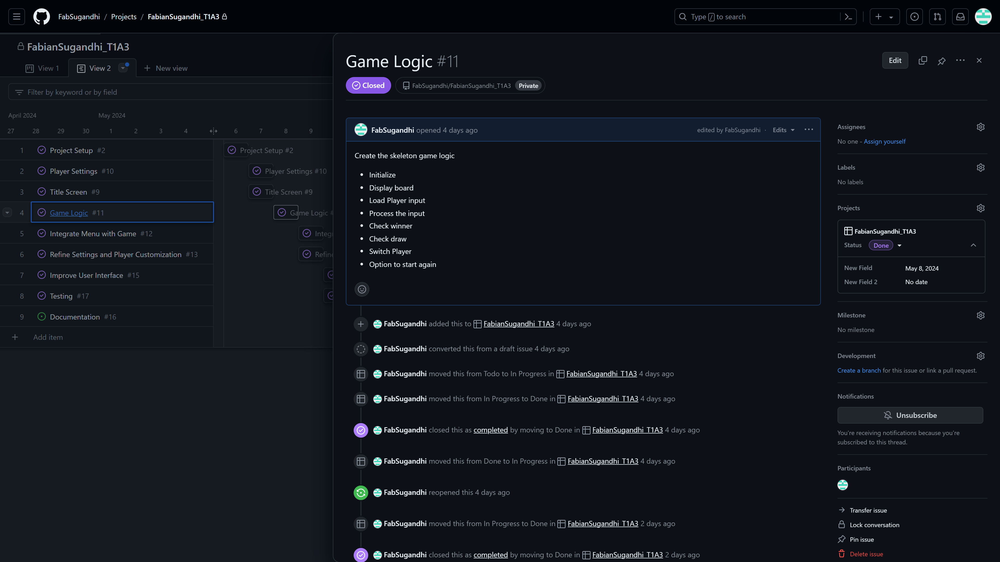

#### Integrate Menu with Game

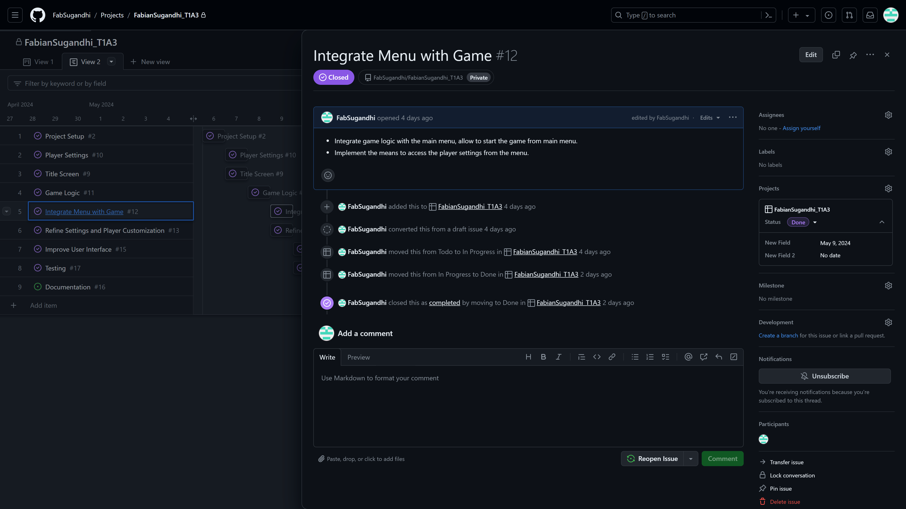

#### Refine Settings and Player Customization

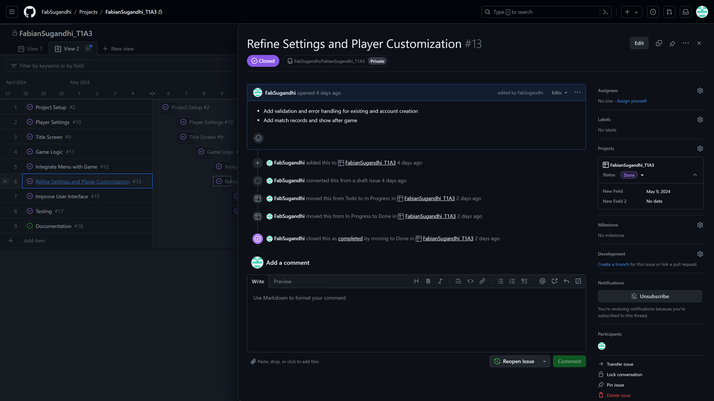

#### Improve Code

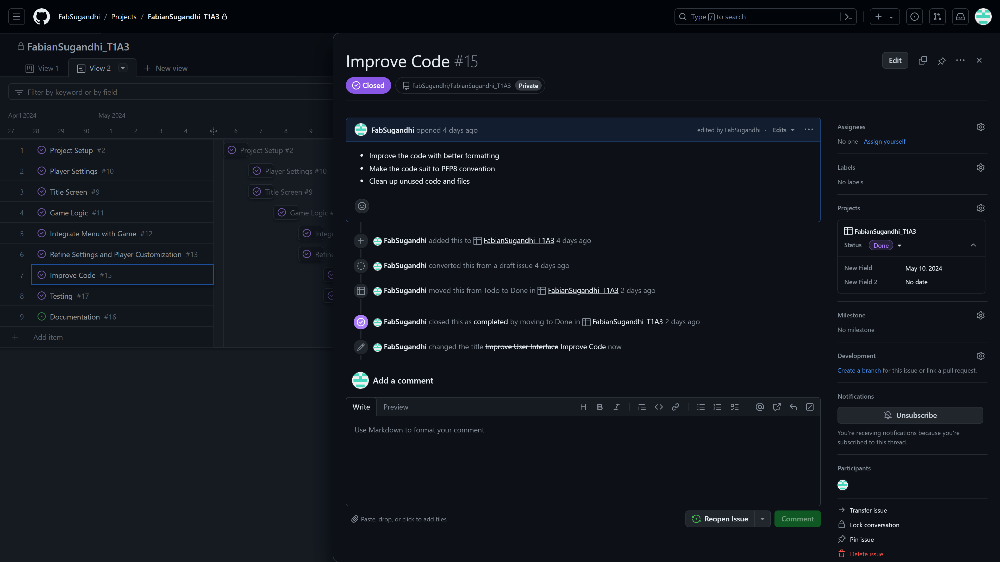

#### Testing and Debugging

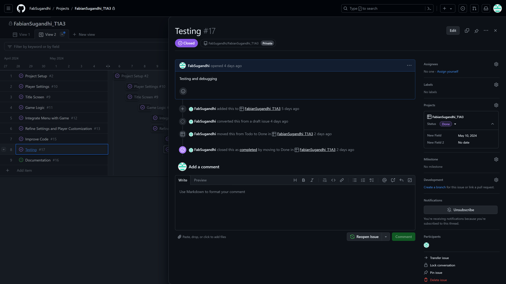

#### End Project Documentation

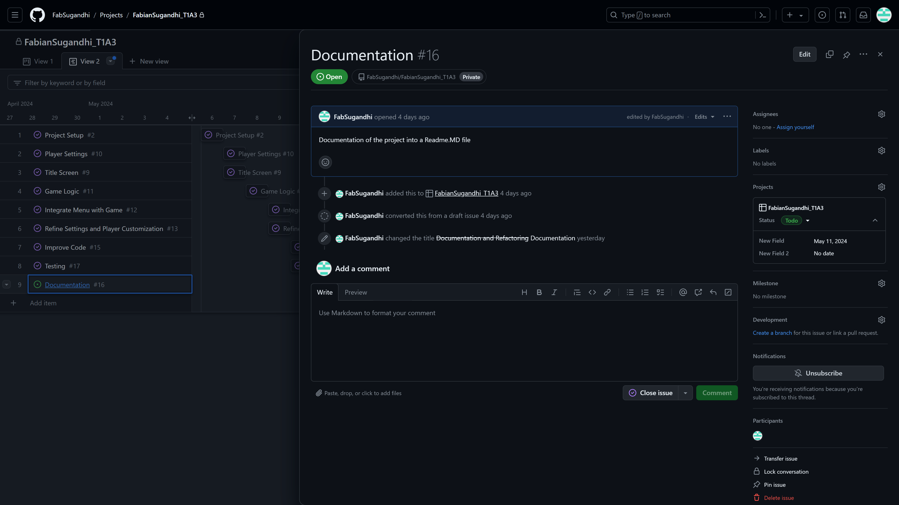

## Help

### System Requirements

Running this application requires Python 3 to be installed in your system. If you don't have it installed already, you can download it through this [link](https://www.python.org/downloads/). If you have Python already installed, you might want to check your Python version to make sure it is able to run this application. To check the installation status and the version of your Python, you can run the following command from your terminal:

```
python --version
```

Or in case this results in an error, you can try running the following command instead:

```
python3 --version
```

This comman will display the version of Python that is installed in your system. This application was developed using Python version 3.12, and thus it is the recommended version. If you have a lower version of Python installed, you can refer to the link above to update your Python installation.

This terminal application also requires several dependencies to run properly. These will utilise pip to be installed. Starting from Python version 3.4 onwards, pip should come bundled with your Python installation. However, if your Python is of an older version, you might need to install it first. You can refer to this [link](https://pip.pypa.io/en/stable/installation/) for pip installation instructions.

### Dependencies

This is the list of dependencies required by this terminal application to run properly.

```
colorama==0.4.6
iniconfig==2.0.0
packaging==24.0
pluggy==1.5.0
six==1.16.0
tomli==2.0.1
```

### Terminal Application Installation

1. Downloading the terminal application
    - Open this application's [Github Repository](https://github.com/FabSugandhi/FabianSugandhi_T1A3)
    - Click on the **"Code"** button on the repository page. It will open a drop-down menu.
    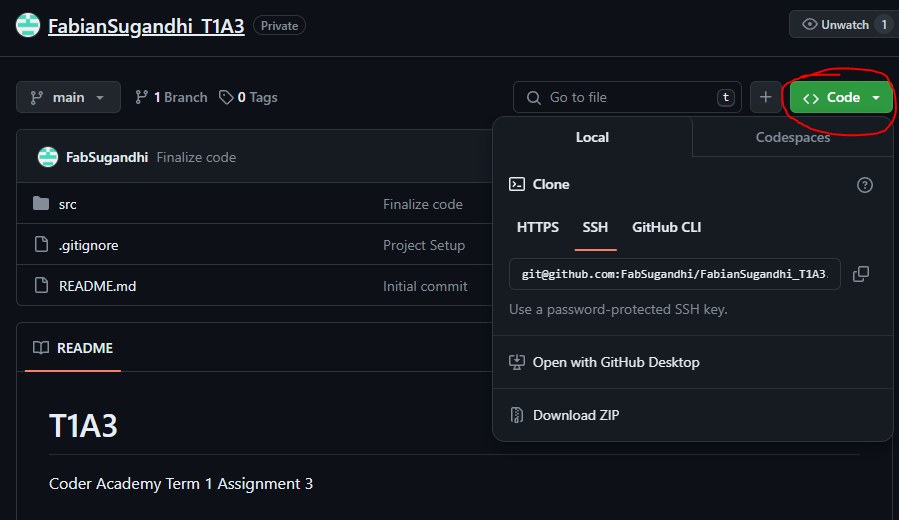
    - Within this drop-down menut, click the **"Download ZIP"** option to download the application's ZIP folder.
    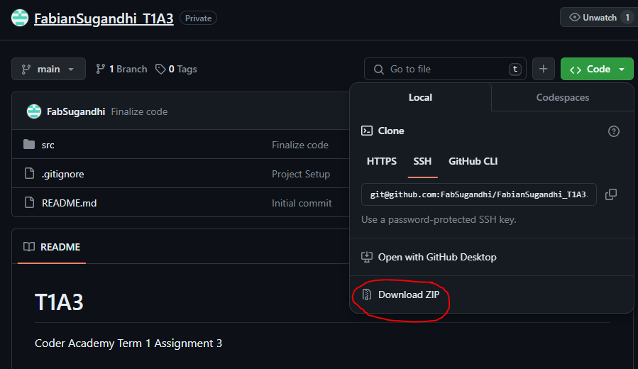
    - Extract the content of the ZIP folder to a path or directory of your choice.
2. Running the terminal application
    - Open a new terminal window.
    - Navigate to the directory where you extracted the contents of the ZIP folder.
    - Once in this directory, run the following command:
    ```./run.sh```.
    This will also check if Python 3 and pip are installed correctly. If they are, this command will create a virtual environment to run the application, and will install the required dependencies. After these steps are completed, it will then automatically starts the application.
    - Sometimes, a permission error occurs due to administation privileges. You can override this by running this command before running the previous ```./run.sh``` command:
    ```chmod +x ./run.sh```.
    - For Windows user, the above command lines might not be allowed to run. In this case, you can run this command first:
    ```icacls rund.sh /grant Everyone:RX```. Followed by this command: ```bash run.sh```.
    - Or you can manually run the application by running this command from your terminal from the directory where the contents of the ZIP folder are extracted: ```python3 menu.py```
3. Dependencies error
    - Dependencies should be installed automatically when you run the application through the ```./run.sh``` command. However, in case of error, you can install them manually by following the steps below:
        - Make sure you are in the directory where you extracted the contents of the ZIP folder.
        - Run the following command: ```python3 -m venv .venv```
        - Then once the virtual environment is created, run the following command to activate the virtual environment:
        ```source .venv/bin/activate```
        (you should now see (**.venv**) before your directory path).
        - Install the dependencies by running this command:
        ```pip install {package name}```. Subsitute the **{package name}** with the name of the actual package that needs to be installed. See the **Dependencies** section above or the **requirements.txt** document for the list of required packages.
4. Using the application
    - This application was created to process the command that you input when prompted. The application will show the valid and available input that will be accepted.
    - Press your keyboard's **Enter** key once you typed in your input. The application will validate your input and show an error message when your input is invalid. Otherwise, it will proceed as appropriate.
    - Except for where the input is case-sensitive (The **Username** input), it is recommended to type in all lowercase letters. While the application is developed to convert all inputs to lowercase letters, this might be helpful to mitigate any unwanted error.
    - This application saves your customized user data to a **JSON** file. In case you would like to modify your user settings, please refrain from modifying the **settings.json** file directly as a typo here can render the file invalid and cause errors when running the application. Instead, you should only modify any user settings via the **Customize Settings** option available through the game menu .

## References

Github, Inc. (2024). About Projects. <https://docs.github.com/en/issues/planning-and-tracking-with-projects/learning-about-projects/about-projects>

Hartley, J., Yaari, A., & Colorama-Dev Team. (2020). Colorama. <https://pypi.org/project/colorama/>

Hasbro, Inc. (2024). Connect 4 Game. Hasbro Shop. <https://shop.hasbro.com/en-au/product/connect-4-game/80FB5BCA-5056-9047-F5F4-5EB5DF88DAF4>

Hukkinen, T & Tomli-Dev Team. (2022). Tomli. <https://pypi.org/project/tomli/>

LogiLab & Pylint Contributors. (2024). Pylint. <https://pypi.org/project/pylint/>

Peterson, B. (2020). Six: Python 2 and 3 Compatibility Library. <https://six.readthedocs.io/>

van Rossum, Warsaw, B., & Coghlan, A. (2023). Pep 8 - Style Guide for Python Code. <https://peps.python.org/pep-0008/>
